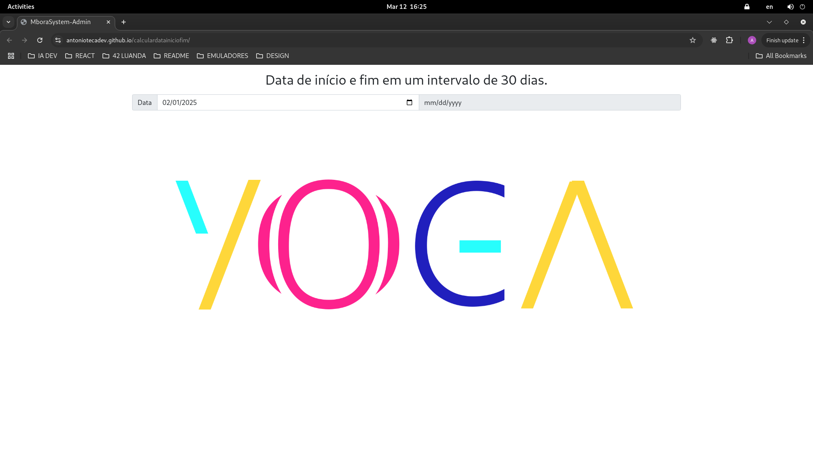
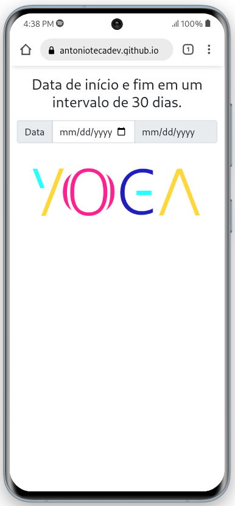

# 🖩 Start and End Date Calculator

This project is a simple date calculator that allows the user to enter a start date and automatically calculate the end date after a 30-day interval. The project was developed using HTML, CSS (with Bootstrap), and JavaScript.

## Demonstration

You can access the hosted version of the project on GitHub Pages: [Start and End Date Calculator](https://antoniotecadev.github.io/calculardatainiciofim/)

### 🖼️ Screenshots

<div align="left">
  
  
</div>

## 📋 Features

- **Automatic End Date Calculation**: When you enter a start date, the system automatically calculates and displays the end date after 30 days.
- **Simple and Intuitive Interface**: The interface was developed with Bootstrap to ensure a pleasant and responsive user experience.
- **Date Validation**: The system ensures that the end date is calculated correctly, considering the different number of days in each month.

## How to Use

1. **Access Page**: Open the project link hosted on GitHub Pages.
2. **Enter Start Date**: In the start date field, select or enter the desired date.
3. **View End Date**: The end date will be automatically calculated and displayed in the corresponding field.

## 🧰 Technologies Used

- **HTML**: Page structure.
- **CSS (Bootstrap)**: Styling and responsiveness.
- **JavaScript**: Date calculation logic.
  
## 📂 Project Structure

The project consists of a single HTML file that contains all the structure, styles, and scripts necessary for the date calculator to function.

```plaintext
calculardatainiciofim/
│
├── LICENSE             # MIT License
├── README.md           # Descriçào do projecto
├── index.html          # Arquivo principal contendo a estrutura HTML, estilos e scripts
└── logotipo-yoga-original.png  # Imagem utilizada na página
```

## 🏢 Used By

This project is used by the following companies:

- YOGA - TECNOLOGIA, COMÉRCIO E SERVIÇO LDA

## 📜 License

This project is licensed under [](https://choosealicense.com/licenses/mit/). See the [LICENSE](LICENSE) file for details.

---

## 🧑‍💻 Author

- **António Teca** [GitHub](https://github.com/antoniotecadev)

---
